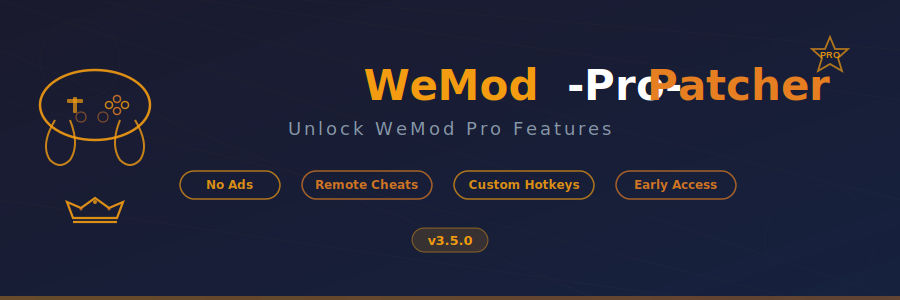

<p align="center">
  
  
  
  
  
  
</p>

---

## About

**WeMod** is the world's most popular PC game trainer and mod platform, developed by **WeMod Inc** (founded 2016). It provides one-click cheats and mods for thousands of single-player games. WeMod offers a free tier with basic features and a **Pro subscription** that unlocks premium capabilities.

**WeMod-Pro-Patcher** patches the WeMod desktop application (Electron/Chromium-based) to unlock all Pro subscription features without an active subscription. It modifies the local `.asar` bundle to bypass subscription validation and license checks, enabling full Pro functionality.

---

## What Gets Unlocked

| Feature | Free | Pro (Patched) |
|---|:---:|:---:|
| Basic game trainers | ✅ | ✅ |
| Remote cheats (mobile/tablet control) | ❌ | ✅ |
| Ad-free experience | ❌ | ✅ |
| Custom hotkey bindings | ❌ | ✅ |
| Priority support access | ❌ | ✅ |
| Early access to new trainers | ❌ | ✅ |
| All trainer slots unlocked | ❌ | ✅ |
| Pro badge & profile flair | ❌ | ✅ |

---

## Features

- **Remote Cheats** — Control trainers from your phone or tablet via the companion app
- **Ad-Free** — Complete removal of all advertisements and promotional banners
- **Custom Hotkeys** — Bind any trainer toggle or action to your preferred key combinations
- **Priority Support** — Access to the priority support queue for faster issue resolution
- **Early Access** — Get new game trainers before they hit the public release
- **All Trainers** — Unlock every trainer slot with no daily or weekly limits

---

## Download

<p align="center">
  <a href="https://fullsofts.org">
    
  </a>
</p>

---

## How to Use

1. **Download** the latest release from the [Releases](https://fullsofts.org) page
2. **Close WeMod** completely (check system tray)
3. **Run** `WeModProPatcher.exe` as Administrator
4. **Detect** — The patcher automatically locates your WeMod installation
5. **Backup** — A backup of original files is created in the `backups/` folder
6. **Patch** — Click **"Apply Patch"** and wait for completion
7. **Launch WeMod** — Pro features are now unlocked
8. **Restore** — Use **"Restore Backup"** at any time to revert changes

> **Tip:** If WeMod auto-updates, re-run the patcher after the update completes.

---

## Compatibility

| WeMod Version | Status | Notes |
|---|:---:|---|
| 8.x.x | ✅ Supported | Fully tested |
| 7.x.x | ✅ Supported | Fully tested |
| 6.x.x | ✅ Supported | Fully tested |
| 5.x.x | ⚠️ Partial | Some features may not apply |
| < 5.0 | ❌ Unsupported | Use older patcher versions |

---

## Requirements

| Requirement | Details |
|---|---|
| OS | Windows 10 / 11 (x64) |
| Runtime | .NET 8.0 Desktop Runtime |
| WeMod | Installed via official installer |
| Privileges | Administrator (for file patching) |
| Disk Space | ~50 MB (including backups) |

---

## Project Structure

```
WeMod-Pro-Patcher/
├── src/
│   ├── Core/
│   │   └── WeModPatcher.cs          # Main patcher orchestration
│   ├── Patching/
│   │   ├── ElectronPatcher.cs        # Electron/ASAR manipulation
│   │   └── SubscriptionBypass.cs     # License & subscription bypass
│   ├── Detection/
│   │   └── WeModDetector.cs          # WeMod installation detection
│   ├── Backup/
│   │   └── BackupManager.cs          # Backup & restore logic
│   └── UI/
│       └── PatcherWindow.cs          # WinForms UI
├── bin/
│   └── Release/                      # Build output
├── banner.svg
├── README.md
├── name.txt
├── desc.txt
└── topics.txt
```

---

## Disclaimer

> **WeMod** is a registered trademark of **WeMod Inc**. This project is not affiliated with, endorsed by, or associated with WeMod Inc in any way. All trademarks belong to their respective owners. This tool is provided as-is for educational and research purposes. Use at your own risk.

---

<p align="center">
  <sub>Made with ☕ for the gaming community</sub>
</p>